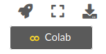

# La Química Cuántica a tu alcance


El objetivo del presente libro digtal es ser un manual de prácticas de la asignatura de **Química Cuántica I (clave 1404)** de la Facultad de Química (UNAM). Algunas prácticas podrían ser de ayuda para cursos más avanzados de Química Cuántica. El libro digital es un esfuerzo compartido de Juan Felipe Huan Lew Yee y de los profesores del Departamento de Física y Química Teórica. Toda retoralimentación es bienvenida, y la invitamos a compartir a los correos:

Juan Felipe Huan Lew Yee: [felipe.lew.yee@gmail.com](mailto:felipe.lew.yee@gmail.com)

Jorge Martín del Campo Ramírez: [jormacara@gmail.com](mailto:jormacara@gmail.com)

José Eduardo Barrios Vargas: [j.e.barrios@gmail.com](mailto:j.e.barrios@gmail.com)


La lectura recomenda es en orden para los alumnos del curso de **Química Cuántica I**. Pueden seguir el orden de los capítulos utilizando la barra de navegación del lado izquierdo o el menú emergente, si están utilizando un dispositivo móvil. Dentro de los objetivos del libro es que ustedes interactuén con el contenido, para lo cual les recomendamos alguna de las dos opciones siguientes:


````{admonition} Ejecución de los notebooks (en línea)
:class: tip
Los ejercicios de este libro requieren un conocimiento básico de Python, mismo que puede adquirirse en el primer capítulo del libro. Los notebooks pueden ejecutarse en línea desde **Google Colab** al presionar el ícono de la nave y dar clic sobre Colab, este ícono aparece en la parte superior de cada notebook. Los archivos generados en Google Colab se guardan automáticamente en su Google Drive. El único requisito este tener una cuenta asociada a **Google**.


````

````{admonition} Ejecución de los notebooks (en computadora)
:class: tip
Puede descargar los *.ipynb y ejecutarlos directamente en su computadora dando click sobre el botón con la flecha apuntando hacia abajo. Para ejecutarlos localmente es su computadora se requiere una instalación previa de Python. En caso de no tenerla puede instalar [Anaconda](https://www.anaconda.com/products/individual). Una vez descargado puede interactuar con el notebook utilizando Jupyter Notebook.

En caso de tener una instalación local de Anaconda en Linux verifique que tenga instaladas las librerías utilizadas en los notebooks. Dichas librerías las puede instalar desde la terminal utilizando las siguientes líneas:
```
conda install matplotlib numpy scipy sympy 
```
Después, puede ejecutar un notebook con Jupyter
```
jupyter-notebook NOMBRE.ipynb
```

Algunos ejercicios utilizan el software psi4, este se puede instalar desde Anaconda con
```
conda install psi4 psi4-rt python=3.7 -c psi4
```
````
